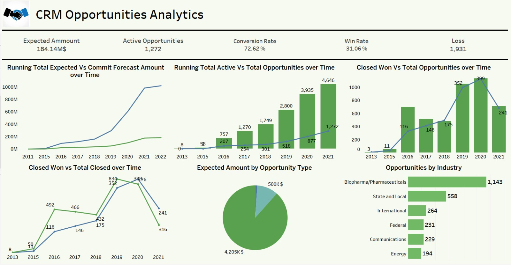
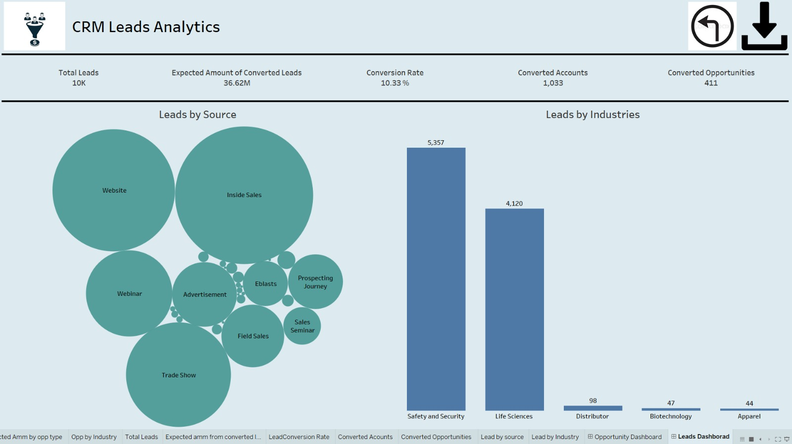

# CRM-Analytics-Tableau-SQL
This CRM Data Analytics project is aimed at analyzing and extracting valuable insights from customer relationship management (CRM) data. CRM systems play a pivotal role in modern business operations, providing a wealth of information about customers, leads, opportunities, and interactions. 
## 1. Opportunity Dashboard KPI's
### i) Expected Amount:  
The anticipated total value of revenue from active opportunities or deals.
  
### ii) Active Opportunities:  
The current number of opportunities or deals that are actively being pursued or considered.
  
### iii) Conversion Rate: 
The percentage of opportunities that successfully convert into closed deals. Calculated as (Closed Won / Total Opportunities) * 100.
  
### iv) Win Rate: 
The percentage of closed opportunities that resulted in a successful deal. Calculated as (Closed Won / Total Closed) * 100.
  
### v) Loss: 
The number or percentage of opportunities that did not result in a successful deal. Calculated as (Total Opportunities - Closed Won).
  
### vi) Trend Analysis: 
Examining historical data to identify patterns or trends that can help in making informed decisions about future opportunities.
  
### vii) Running Total Expected Vs Commit Forecast Amount over Time: 
Monitoring the cumulative expected amount versus the committed forecast amount over a period, providing insights into the accuracy of forecasting.
  
### viii) Running Total Active Vs Total Opportunities over Time: 
Tracking the cumulative number of active opportunities compared to the total number of opportunities over time, indicating the overall activity level.
  
### ix) Closed Won Vs Total Opportunities over Time: 
Analyzing the cumulative number of closed-won opportunities in comparison to the total number of opportunities, highlighting the success rate over time.
  
### x) Closed Won vs Total Closed over Time: 
Monitoring the cumulative number of closed-won opportunities versus the total number of closed opportunities, showing the success rate over time.
  
### xi) Expected Amount by Opportunity Type: 
Breakdown of the expected amount based on different types or categories of opportunities, providing insights into which types contribute the most.
  
### xii) Opportunities by Industry: 
Categorizing opportunities based on the industry they belong to, helping in understanding the distribution and focus of opportunities across different sectors.

